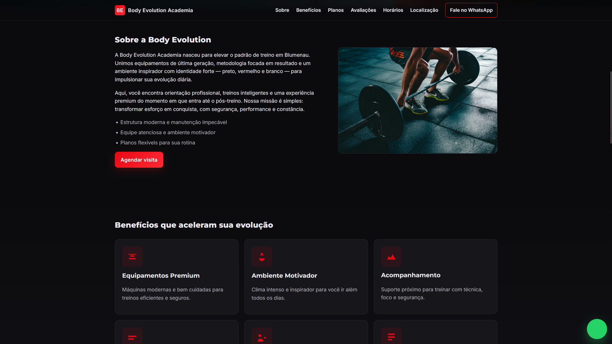
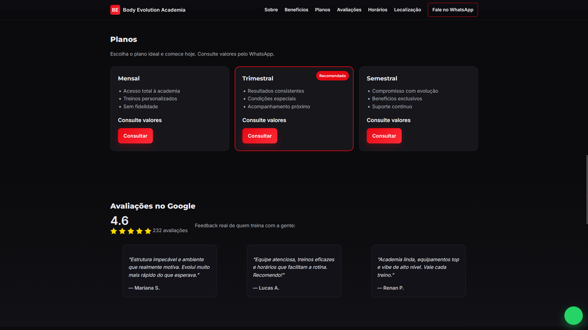

# Site Academia

Projeto desenvolvido para uma academia local com o objetivo de apresentar seus serviços, estrutura e informações de contato por meio de uma interface moderna e responsiva.

Este projeto foi criado como prática de desenvolvimento front-end, aplicando conceitos de design responsivo, organização de conteúdo e experiência do usuário.

## Funcionalidades

* Página inicial institucional
* Apresentação da academia
* Exibição dos serviços oferecidos
* Seção de contato
* Navegação intuitiva
* Layout responsivo para diferentes dispositivos

## Tecnologias Utilizadas

* HTML5
* CSS3

  * Flexbox
  * Media Queries
  * Animações e Transições
* JavaScript

## Design

O projeto foi desenvolvido com foco em clareza visual e facilidade de navegação, utilizando uma estrutura simples e objetiva para destacar as informações mais importantes da academia.

## Responsividade

Desenvolvido para funcionar corretamente em:

* Smartphones
* Tablets
* Notebooks
* Monitores widescreen

## Screenshots

<p align="center">
  
  
  
</p>


## Demonstração

[](https://garygarcia2703.github.io/site-academia/)


## Aprendizados

Durante o desenvolvimento deste projeto foram praticados conceitos importantes de:

* Estruturação de páginas com HTML
* Estilização utilizando CSS
* Criação de layouts responsivos
* Organização de arquivos front-end
* Desenvolvimento de interfaces voltadas para usuários reais

## Estrutura do Projeto

```bash
site-academia/
├── css/
├── img/
├── js/
├── index.html
└── ...
```

## Autor

Gary García
